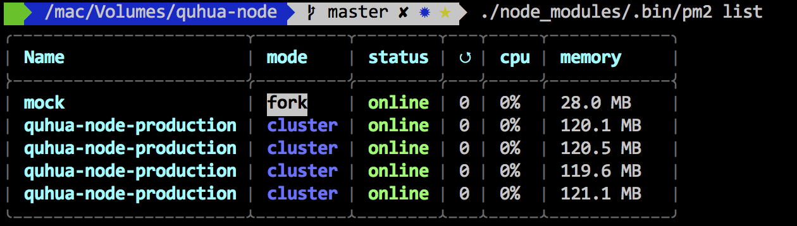

# react-router-redux-ssr-boilerplate
此项目为react+node的同构框架模板

## 相关技术
```react``` ```redis``` ```node``` ```express``` ```pm2``` ```heamdump``` ```socket.io```

## 核心依赖版本说明
- react > 16.0.0
- react-dom > 16.0.0
- react-router > 4.2.0 （必须）
- react-router-redux > 5.0.0 (必须)


## 如何部署
通用的流程
- 启动 接口服务（mock-server)
- 启动 redis服务器
- 开始打包构建
- 开启守护进程 开启http服务监听主线程

### 注意
- 若要将本demo，必须在本机安装 redis 作为前提，并配置redis端口为6379 ，密码为umbrella
- 代码分割[code-splitting](https://webpack.js.org/guides/code-splitting/)的方案参考 ```src/routes/async.js```，有别于react-router4之前的getComponent
- [react-router4](https://reacttraining.com/react-router/web/guides/philosophy)与react-router之前的版本有很多不同，很多老的方法不能使用，同理需要react-router-redux5
- 相关的代码建议放到一个文件夹下，如下所示
```
├── Example （view的名称叫做Example
│ ├── index.js (入口)
│ ├── Example.jsx (视图文件)
│ ├── ExampleAction.jsx (定义redux动作)
│ ├── ExampleReducer.jsx (定义相关reducer)
│ ├── Example.scss (Example的样式)
```
- pm2的配置，参考[http://pm2.keymetrics.io/docs/usage/quick-start/](http://pm2.keymetrics.io/docs/usage/quick-start/)
配置文件在 pm2-config.json中

### 文件结构说明
```
├── dist/  (最终的打包目录，包含前端静态文件和后端运行文件)
├── public/  (公共文件夹，暂时弃用)
├── webpack/  (webpack配置文件存放的文件夹)
├── src/   (前后端公用文件夹)
│  ├── store/  (包括reducer、store)
│  ├── utils/  (通用工具函数)
│  ├── routes/  (路由入口，作为前端和后端渲染的入口)
│  ├── assets/  (图片资源文件)
│  ├── views/  (视图层)
```
server 文件夹详细说明
```
├── server/   (前后端公用文件夹)
│  ├── Html.js  (HTML模板)
│  ├── server.js  (express服务)
│  ├── server.dev.js  ( webpack-dev-middlware + webpack-hot-middleware )
│  ├── server.online.js  (线上的设定，暂时空)
│  ├── ssr.js  (服务端渲染控制器)
│  ├── routes/ (特定规则下，例如请求远端接口进行反向代理和缓存用)
│  ├── utils/  (工具函数)
│  │  ├── redis.js  (redis-cli客户端连接)
│  │  ├── socket.js  (socket.io服务端建立)
```

### 开发环境
在clone到本地，以及执行 npm | yarn install 后
```bash
npm run mock //运行本地mock，mock使用方法参考[https://github.com/skidxjq/mock-server](https://github.com/skidxjq/mock-server)
npm run dev
```

如果是通过pm2 启动，则执行
```bash
npm run pm2-dev
```
打开浏览器访问

[http://localhost:54321/local](http://localhost:54321/local)

mock接口地址

[http://localhost:55555/interface-admin/public/index.html](http://localhost:55555/interface-admin/public/index.html)
### 线上环境
线上环境需根据个人情况而定，本demo假定依然在本地部署，需要经过
```bash
npm run dist
npm run production
```
打开浏览器访问

[http://localhost:54321/online](http://localhost:54321/online)

如果是pm2启动，则执行（开启cluster模式，运行的实例数等于cpu的个数)
```bash
npm run pm2-production
```
执行pm2 list 如下



