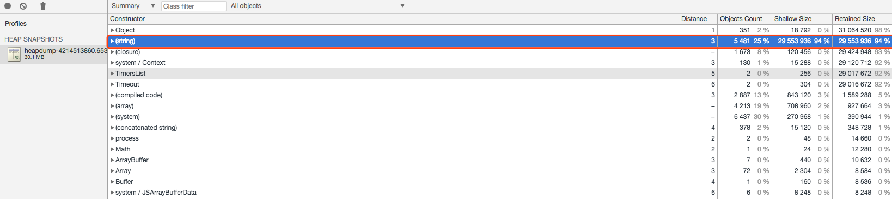
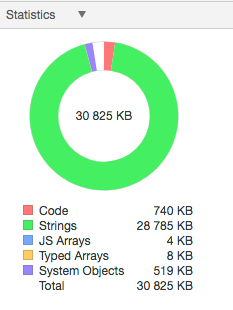
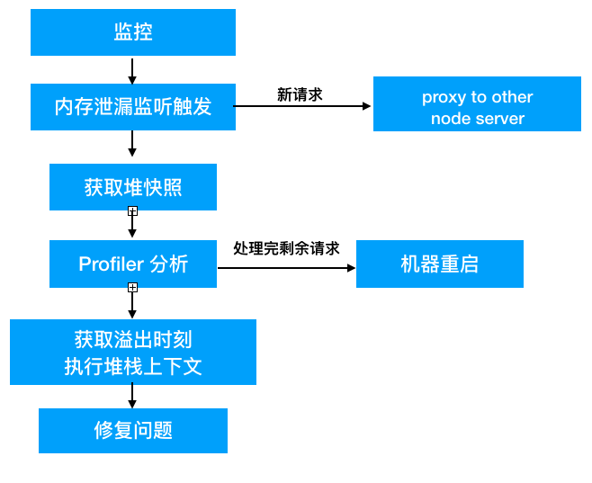
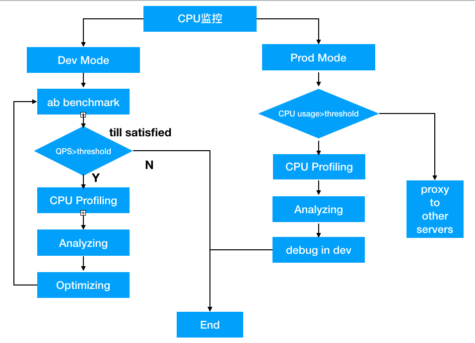
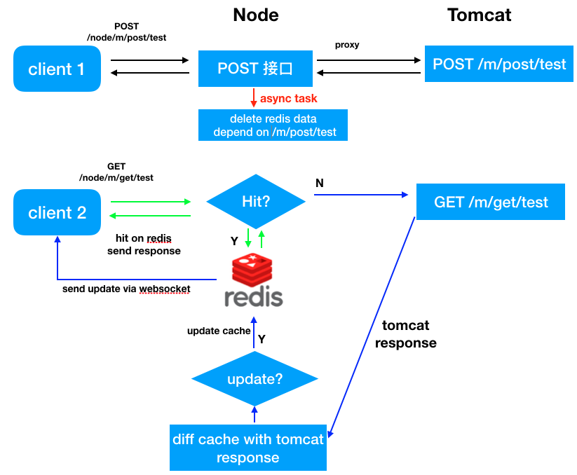
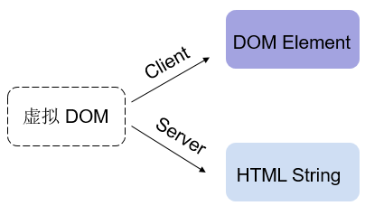
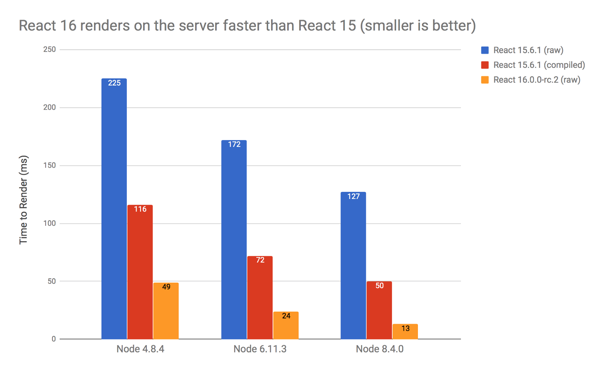
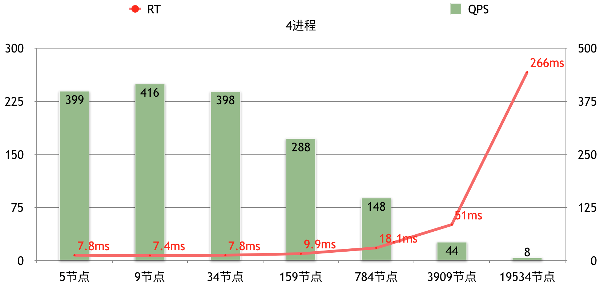
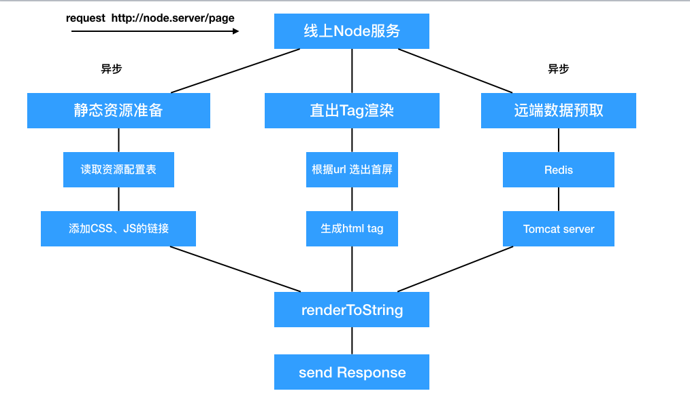
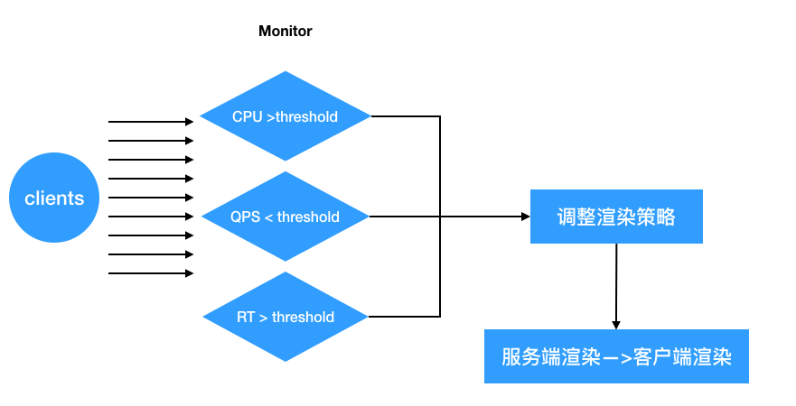

Node.js 是前端开发利器，但是关于 Node.js 的线上实践很少有完整的解决方案，鉴于ndp已经开放node.js的部署，且公司内部（如美学、云音乐等）若干部门已经开始将 Node.js 运用到线上，如何在服务器端```科学的```解放前端工程师的生产力？本文将着重以下若干方面对 Node.js 的线上实践进行描述。

[ndp部署Node.js 教程](http://ks.netease.com/blog?id=9378)

NDP的部署Node应用如下图所示，分为<b>构建阶段</b>和<b>部署阶段</b>


- [Node.js 适用场景描述](#node-js-)
- Node.js 线上突发情况处理
- Node.js View层生态
- Node.js 与 React 的同构实践

## 纯静态开发的困难场景
目前线上的诸多项目均部署在CDN上，所以对于如以下的场景会出现非常多的困难
```
场景一：
客服：A用户投诉这个地方点击不了，
前端：后端，你去查下日志，看下A用户在XX时刻发了啥请求
后端：。。。好的（mmp)，然后开始找日志。
后端：日志我找到了，我把那个时候的请求的数据给你，你在本地测试一下。
前端：好的
```
此过程中，如果后端人不在、有其他任务并行，则反馈到客服那里的时间可能更长，
即使是接入[APM](http://apm.netease.com)，也只能检测到执行错误的那一行代码，且线上JS代码均为压缩混淆后的，排查基本没戏
```
场景二：
产品：咦，这个页面每次进来都要显示加载中，读取数据么
前端：因为每次进来都要执行加载数据的操作啊，后端接口稍微返回晚一点，我们就显示加载中的模态窗
产品：能否优化下，后面几次点进来的数据都是一样的呀，可以不用让他请求了
前端：可是我怎么知道用户的服务器状态有没有更改，代码是静态的，我们没法根据用户的状态做定制化操作。
```
这种情景下，前端对于这种优化是无力的。究其原因是因为目前的开发方式都是前后端完全分离，均是面向接口开发，而前端更的核心更应该是面向View层开发。


```
场景三：
运营：这个活动页面有些文案需要修改一下 X1
前端：好的
（打包->测试->发布）X1
运营：这个活动页面有些文案需要修改一下 X2
前端：好的
（打包->测试->发布）X2
运营：这个活动页面有些文案需要修改一下 X3
前端：好的
（打包->测试->发布）X3
```
在不开发没有运营系统，每个运营页面的开发都是快速迭代，修改文案又会涉及到发布验证，且打包任务很重，配置繁琐。可不可以只需要一个配置文件，让运营上传配置文件，减少对主业务的构建和影响。
<b>使用 Node 围绕 View 层做核心开发</b>
关于服务端渲染为了做SEO优化来说，如果对于移动端项目，则意义不大，因为获取的路径主要不是搜索引擎。

## Node.js 适用场景描述

又要祭出这张Node.js原理图了


大致分为四个步骤
- ① 客户端发起请求
- ② <b>JS主线程</b>Event Loop 捕获请求执行
- ③ 将异步、IO等非阻塞任务丢给内部线程执行，<b>JS主线程</b>继续执行其他任务
- ④ 异步任务执行完成后，JS主线程捕获任务结果，并执行异步任务设定的回调函数

其中③的过程开发不可控，这部分由libuv与操作系统交互完成。

所以开发人员务必要保证②的完整传递，这种前提导致node绝壁不适合密集型计算，否则就会出现下面的情况。


Node针对所有请求都只用一个线程，决定了以下优势和劣势
- ① 节省了线程创建开销（线程控制块、线程执行上下文）。
- ② CPU执行线程切换的成本。
- ③ 假如有一个请求导致请求崩溃，那么其他所有的请求都GG。

所以对比其他后台语言开发模型，在线上Node.js最适合的场景
- 重IO的应用，比如云盘
- 实时系统，比如直播，socket通信，监控
- 流处理，如反向代理
- V层 api数据缓存

### 开发准则
- 为了让主线程对于每一个请求，雨露均沾，别让一个请求呆在主线程上太久，能丢给异步的就丢给异步
- 类似所以开发环境常用的```fs.readFileSync``` 等各种Sync操作，是绝对不可以的。
- 严格的闭包和对象使用，避免内存泄漏
- JS线程执行的中间产物和变量，能复用就复用，能缓存就缓存，没有的就释放

## Node.js 突发情况处理
Node最为让人诟病的地方就是如何跟踪定位线上问题，除了JS执行的主线程外，异步任务、内存分配均在libuv和v8中完成，除了重启好像并没有什么更好的办法，

### 使用PM2
（[PM介绍](http://pm2.keymetrics.io/docs/usage/quick-start/)）部署node 总不能来一个 node ./bin/www ，挂了怎么处理，怎么收集日志，怎么监控
PM2 核心功能
- Cluster模式，让每个CPU上都运行一个JS主线程，单机内部的负载均衡
- 收集日志，包括http.log和error.log
- 监控JS主线程实时内存、CPU使用率
- 监听任务，如果程序被kill，则执行重启操作
r
```bash
$ pm2 list
```


### 内存溢出
对于浏览器来说，内存溢出在用户浏览器，出了问题不会波及到服务器和其他用户，但是在服务器端，这种问题就需要引起重视，除了代码本身的良好的对象定义与引用规范外，高并发的场景下，对象的分配与释放进行监控。
#### 在开发阶段
使用```node --inspect```执行，并使用chrome DevTools去捕获

#### 在线上阶段：
- 1.从哨兵或者pm2监控，查看内存使用，如果一段时间内持续升高，超过某个设定的阈值报警
- 2.查找溢出时段的堆栈快照信息，设在t1时刻和t2时刻获取堆栈信息为H(t1)和H(t2)，则去检测增量，这里以```heapdump``` 使用为例

下方是一段有问题的代码 会引起内存泄漏，叫做leak1.js
```js
let leakObject = null
let count = 0

setInterval(function testMemoryLeak () {
  const originLeakObject = leakObject
  const unused = function () {
    if (originLeakObject) {
      console.log('originLeakObject')
    }
  }
  leakObject = {
    count: String(count++),
    leakStr: new Array(100).join('*'),
    leakMethod: function () {
      console.log('leakMessage')
    }
  }
}, 1000)

// 
memwatch.on('leak', (info) => {
  heapdump.writeSnapShot((err, filename) => {
    if(err) console.err(err)
    else console.error('wrote to snapshot:', filename)
  })
})
```
执行以下脚本作为启动程序，并等生成heapdump-XXXXXXX.heapsnapshot文件，并使用Chrome DevTools -> Memory -> Profiles -> Load，如下图，其中可以展开发现，Object Counts 统计过多没有释放



而切换到 Statistics 统计数据，发现字符串占用了绝大多数堆空间



综上，内存分析的流程如下



### CPU使用分析

保证每一个请求快速来，快速走，其他任务丢给异步，保证高QPS，分析工具包括有```v8-profiler```,```FlameGraph```等，

#### 开发阶段
使用`ab` `loadtest`进行压测，当CPU超过设定安全阈值后，捕获CPU执行栈，进行解读

#### 线上阶段
哨兵报警CPU后，获取两阶段CPU的profiler，开发人员获取后进行分析和问题排查，尽可能的复现出现问题时刻的场景，生成火焰图帮助排查。

上述两阶段的流程如下所示



## Node.js 前端优化

### 接口缓存
```
场景

在浏览信息更多的应用中，用户来回切换页面会调用同一个接口多次，每次读的数据均相同，造成前端等待时间过长。
```

程序运行的局部性原理，同样可以运用到web应用中，我们设定以下规则
* 对需要缓存的GET接口，设置缓存配置表，如下```api-cache.json```。每个接口设置```url```, ```depend```决定是否当depend对应的接口更新后，删除当前url对应的缓存数据。
* ```async```为 true 的时候，可以提前读取缓存数据返回，并请求后端服务，如果有更新，再以websocket方式返回给前端更新
```js
[{
  'url': 'm/api/test-1',
  'depend': 'm/post/test',
  'async': true,
  'method': 'GET',
}]
```
* 由于 POST 接口不具有幂等性， POST接口一般不做缓存，直接代理到实际的后端业务接口
* 先行设定，POST A接口将可能会影响某些GET接口数据，当POST A接口请求后，清除
在我们的设计中，我们对所有的后端接口，均做一层映射，映射规则如下，对于后端给定的接口 /m/api/test ，前端均请求至/node/m/api/test Node路由处,
> send request /node/m/api/test（node路由） ----node---> proxy to /m/api/test（java接口）

大体流程如下图所示，可以从夸父系统申请```redis```服务器一台，使用```socket.io```建立 websocket 服务器，监听客户端连接，因为redis可以存取任意长度的键值对，我们采取 ```接口名称-会话id-请求参数``` 设置唯一key，如下片段所示

```js
var redisKey = [
  req.url,
  req.cookie.jsessionid,
  JSON.stringify(req.params）
].join(':')
```


### 用户数据抓取
```
场景：
运营：GA上能看到每个用户的数据么
前端：不能的呢，GA上只能看到总体统计上的转化，没有以用户为维度的呢，你得找后端看看
后端：我这里的访问日志太多了，而且只有接口访问的日志，要整理出用户的有点困难。
```
大前提：
- 由于 CDN 和 Tomcat 服务分开部署，View层被割裂，导致后期跟踪一个用户的访问习惯非常不方便。
- 业务迭代较快的时候，关于View层的需求会被业务需求滞后，而且与后端开发联调成本高。
- 所以View层的生态建设，对于web应用的从用户角度的健康迭代有很多帮助。

如何建立View层生态
- 在使用Node做中间层之后，Node可以拦截每个经过的接口请求，并根据session反差用户ID，记录用户的接口访问记录，并且在加上首屏渲染后，也知道用户在何时访问到首屏。
- 对于单页应用，路由切换并不会被后端感知，我们可以写一个简单的 Node 服务收集用户切换路由的路径，收集到的数据可以更完整重现用户场景，数据格式如下
```js
  app.on('hashchange', function(event) {
    sendToNode({
      type: 'hashchange',
      nextRoute: location.hash,
      time: Date.now(),
      prevRoute: oldlocation.hash
    })
  })
```
- 点击事件的收集，判断用户热区
```js
  app.on(['click','tap'], function(event) {
    sendToNode({
      type: 'screen click',
      agent: navigator.userAgent
      Xaxis: event.clientX,
      Yaxis: event.clientY,
    })
  })
```
- 按钮、链接等点击区域反应时间收集,帮助优化交互体验
```js
  button.on('click', function(event) {
    sendToNode({
      dom: button.getInstanceId(),
      latence: Date.now() - event.timeStamp()
    })
  })
```
综上，可以在View层直接复原用户画像
```
cat user1-2017-12-14.view.log
.....
user1 use iPhone_11_0_1 os
user1 GET index.html 200 2017-12-14 09:30:40
user1 repay-button click 2017-12-14 09:31:40
user1 change-router to /bill 2017-12-14 09:35:40
user1 leave bill page 2017-12-14 09:35:40
......
```
## Node.js 与 React 的同构实践
DEMO代码见
[https://github.com/skidxjq/react-router-redux-ssr-boilerplate](https://github.com/skidxjq/react-router-redux-ssr-boilerplate)
### 关于同构
#### 何为同构
由于前后端时候的相同的语言，所以前后端在代码的共用上达到了新的高度，页面模版、node modules 都可以做成前后通用。同构的雏形，只是共用的代码还是有局限。
有了Node 后，前端便有了更多的想象空间。前端框架开始考虑兼容服务端渲染，提供更方便的 API，前后端共用一套代码的方案，让服务端渲染越来越便捷。当然，不只是 React 做了这件事，但 React 将这种思想推向高潮，同构的概念也开始广为人传。

React 的虚拟 Dom 以对象树的形式保存在内存中，并存在前后端两种展露原型的形式。
- 客户端上，虚拟 Dom 通过 ReactDOM 的 Render 方法渲染到页面中
- 服务端上，React 提供的另外两个方法：ReactDOMServer.renderToString 和 ReactDOMServer.renderToStaticMarkup 可将其渲染为 HTML 字符串。
#### 同构关键要素
完善的 Compponent 属性及生命周期与客户端的 render 时机是 React 同构的关键。且需要在前后端渲染相同的 Compponent，将输出一致的 Dom 结构。服务器上的生命周期只会走到```componentWillMount```，服务端结合数据将 Component 渲染成完整的 HTML 字符串并将数据状态返回给客户端，客户端会判断是否可以直接使用或需要重新挂载。



#### 场景与思考
同构的出发点不是 “为了做同构，所以做了”, 而是回归业务，去解决业务场景中SEO、首屏性能、用户体验 等问题，驱动我们去寻找可用的解决方案。在这样的场景下，除了同构本身，我们还需要考虑的是:
- 高性能的 Node Server
- 可靠的 同构渲染服务
- 可控的 运维成本
- 可复用的 解决方案

#### React16 SSR
FB在9.26发布了React16正式版，之前万众期待的SSR性能提升没有让大家失望, 引用React核心开发Sasha Aickin的对比图



做个试验，当使用pm2开启4个进程的时候，渲染不同数目的结点，响应时间（RT)和QPS的处理曲线比对如下


### 实现机制
- 前端工程打包配置方式无特殊处理。
- 后端工程打包，选择后端渲染的入口文件打包，在webpack配置中（见webpack/_ssr.js)，需要对打包```react-router```中的StaticRouter可以提供一个路径，则会匹配子节点中的路由，渲染出对应的tag，如下所示
```js
import { StaticRouter } from 'react-router-dom'

var Layout = require('./server.entry.js')
htmlCode = ReactDOM.renderToString(
  <StaticRouter>
    <Layout />
  </StaticRouter>
  
)
```
- webpack中去除html-webpack-plugin，转而使用```assets-webpack-plugin```，打包后生成资源映射文件，如下所示。

客户端映射文件，打包后生成地址在```dist/assets.json```
```json
{
  "vendor": {
    "js": "/dist/vendor-67bfd404.js"
  },
  "app": {
    "js": "/dist/app-a64e4c79.js",
    "css": "/dist/css/app-b2a7ffe4.css"
  },
  "manifest": {
    "js": "/dist/manifest-c89d9835.js"
  }
}
```

服务端资源映射，打包后生成地址在```dist/ssr-assets.json```
```json
{
  "ssr": {
    "js": "/dist/ssr-95320bcba93590a96a18.js",
    "css": "/dist/css/ssr-34454a3c.css"
  }
}
```


### 开发环境/线上环境服务端实现
- 在开发环境，会用到```webpack-dev-middleware```和```webpack-hot-middleware```，且开发环境的没有样式文件入口，所以 开发环境不做首屏直出。
- 在生产环境，根据上述描述的资源文件做以下三件事情
  - 引用css路径所在资源（默认css只有一个文件）
  - 引用manifest文件（此文件为客户端静态资源记录表，客户端执行业务逻辑的入口，必须）
  - 引用客户端入口文件
- 如果需要远端数据，则可以声明变量的方式，挂在到客户端window对象上执行
代码如下
```js
const initialState = `window.__INITIAL_STATE = ${JSON.stringify(state)}`
const initialData = `window.__INITIAL_DATA=${JSON.stringify(data)}`

class HTML extends React.Component {
  render() {
    return (
       <html>
        <head>
          <meta charSet='utf-8' />
          <title>{title}</title>
          {isProduction &&
            <link rel='stylesheet' href={ssr.css} />}

        </head>
        <body>
          <script dangerouslySetInnerHTML={{ __html: initialState }} />
          <script dangerouslySetInnerHTML={{ __html: initialData }} />
          {isProduction
            ? <div id='root' dangerouslySetInnerHTML={{ __html: htmlCode }} /> : <div id='root' />
          }
          {isProduction && <script dangerouslySetInnerHTML={{ __html: manifest.text }} />}
          {isProduction && <script src={vendor.js} />}
          <script src={isProduction ? app.js : '/dev/app.js'} />
        </body>
      </html>
    )
  }
}
```
具体流程如下图所示


### SSR的性能考量
SSR虽然帮助完善了SEO，首屏直出，但是在高并发场景下，主线程就显得力不从心了，我们从新审视下JS主线程不能丢给异步做的事情
- 创建浏览器历史
- 创建store
- 根据url，计算直出所需的html tag

根据不同的业务场景，当路由所对应的React Component 对应的组件数和层级提升的时候，计算所消耗的资源也增加，由于其单线程特性，这个痛点是不能通过加机器来分担的，只能做降级处理，况且 React的直出过程 存在潜在的内存泄漏。
由于浏览器的特性，同步的JS逻辑执行完成，才会出现首屏，当SEO的需求没有那么强的时候，可以将服务器端异步获取的数据，以全局变量形式返回给前端，前端获取渲染，不会造成屏闪的现象。
举例，例如我在服务器端获取的数据。
在server.js中
```js
fetchData(data) => {
  const initialData = `window.__INITIAL_DATA=${JSON.stringify(data)}`

  return (
    ///
    <script dangerouslySetInnerHTML={{ __html: initialData }} />
    ///
  )
}）
```
在客户端Reducer中，判断```window.__INITIAL_DATA```有无所需的数据，
```js
const defautState = {
  /// default data 
}
const initialState = window.__INITIAL_DATA ? window.__INITIAL_DATA : defautState

export default function(state = initialState, action){
  ///
}
```
大致流程图如下


### 懒加载
react-router 4 中code splitting的方案有所改变，去除getComponent方法，改用webpack中自带的System.import, 具体使用参照仓库中的实现
在[https://github.com/skidxjq/react-router-redux-ssr-boilerplate](https://github.com/skidxjq/react-router-redux-ssr-boilerplate)中，
- src目录包含前后端公用的代码，
- client为前端引用入口文件
- server为服务器端文件

####  必备插件
## 其他

- Node.js中的事务处理如何保持

- 静态资源的获取依旧交由Nginx处理，减轻Node服务器的负担

## 什么样的老业务适合迁移到Node上
- 前后端完全分离业务

## 参考资料
[https://strongloop.com/strongblog/how-to-heap-snapshots/](https://strongloop.com/strongblog/how-to-heap-snapshots/)
[Debugging-node-js-in-production](https://www.youtube.com/watch?v=O1YP8QP9gLA)
[https://zhuanlan.zhihu.com/p/27202822](https://zhuanlan.zhihu.com/p/27202822)