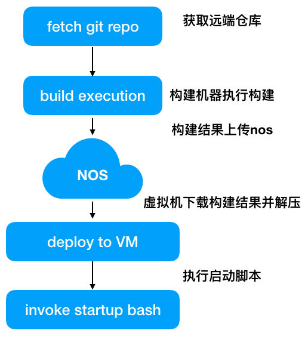
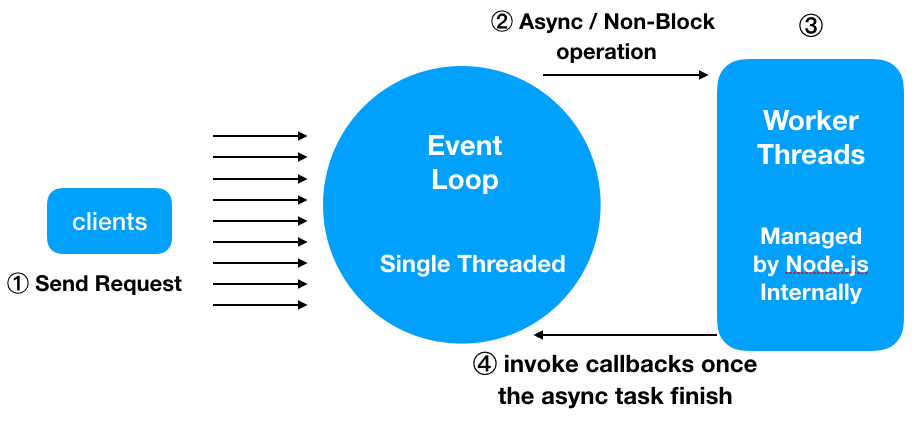
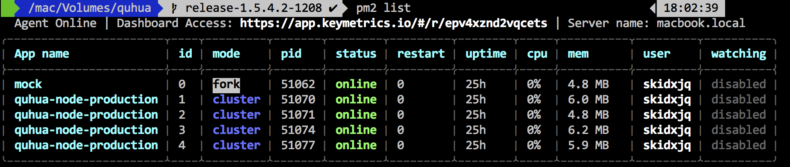

Node.js 是前端开发利器，但是关于 Node.js 的线上实践很少有完整的解决方案，鉴于ndp已经开放node.js的部署，且公司内部（如美学、云音乐等）若干部门已经开始将 Node.js 运用到线上，如何在服务器端```科学的```解放前端工程师的生产力？本文将着重以下若干方面对 Node.js 的线上实践进行描述。

[ndp部署Node.js 教程](http://ks.netease.com/blog?id=9378)
NDP的部署Node应用如下图所示，分为<b>构建阶段</b>和<b>部署阶段</b>



- [Node.js 适用场景描述](#node-js-)
- Node.js 线上突发情况处理
- Node.js 对前端的优化
- Node.js 与 React 的同构实践

## 纯静态开发的困难场景
目前线上的诸多项目均部署在CDN上，所以对于如以下的场景会出现非常多的困难
```
场景一：
客服：A用户投诉这个地方点击不了，
前端：后端，你去查下日志，看下A用户在XX时刻发了啥请求
后端：。。。好的（mmp)，然后开始找日志。
后端：日志我找到了，我把那个时候的请求的数据给你，你在本地测试一下。
前端：好的
```
此过程中，如果后端人不在、有其他任务并行，则反馈到客服那里的时间可能更长，
即使是接入APM[http://apm.netease.com]，也只能检测到执行错误的那一行代码，且线上JS代码均为压缩混淆后的，排查基本没戏
```
场景二：
产品：咦，这个页面每次进来都要显示加载中，读取数据么
前端：因为每次进来都要执行加载数据的操作啊，后端接口稍微返回晚一点，我们就显示加载中的模态窗
产品：能否优化下，后面几次点进来的数据都是一样的呀，可以不用让他请求了
前端：可是我怎么知道用户的服务器状态有没有更改，代码是静态的，我们没法根据用户的状态做定制化操作。
```
这种情景下，前端对于这种优化是无力的。究其原因是因为目前的开发方式都是前后端完全分离，均是面向接口开发，而前端更的核心更应该是面向View层开发。


```
场景三：
运营：这个活动页面有些文案需要修改一下 X1
前端：好的
（打包->测试->发布）X1
运营：这个活动页面有些文案需要修改一下 X2
前端：好的
（打包->测试->发布）X2
运营：这个活动页面有些文案需要修改一下 X3
前端：好的
（打包->测试->发布）X3
```
在不开发没有运营系统，每个运营页面的开发都是快速迭代，修改文案又会涉及到发布验证，且打包任务很重，配置繁琐。可不可以只需要一个配置文件，让运营上传配置文件，减少对主业务的构建和影响。
<b>使用 Node 围绕 View 层做核心开发</b>
关于服务端渲染为了做SEO优化来说，如果对于移动端项目，则意义不大，因为获取的路径主要不是搜索引擎。

## Node.js 适用场景描述

又要祭出这张Node.js原理图了


大致分为四个步骤
- ① 客户端发起请求
- ② <b>JS主线程</b>Event Loop 捕获请求执行
- ③ 将异步、IO等非阻塞任务丢给内部线程执行，<b>JS主线程</b>继续执行其他任务
- ④ 异步任务执行完成后，JS主线程捕获任务结果，并执行异步任务设定的回调函数

其中③的过程开发不可控，这部分由libuv与操作系统交互完成。

所以开发人员务必要保证②的完整传递，这种前提导致node绝壁不适合密集型计算，否则就会出现下面的情况。


Node针对所有请求都只用一个线程，决定了以下优势和劣势
- ① 节省了线程创建开销（线程控制块、线程执行上下文）。
- ② CPU执行线程切换的成本。
- ③ 假如有一个请求导致请求崩溃，那么其他所有的请求都GG。

所以对比其他后台语言开发模型，在线上Node.js最适合的场景
- 重IO的应用，比如云盘
- 实时系统，比如直播，socket通信，监控
- 流处理，如反向代理
- V层 api数据缓存

### 开发准则
- 为了让主线程对于每一个请求，雨露均沾，别让一个请求呆在主线程上太久，能丢给异步的就丢给异步
- 类似所以开发环境常用的```fs.readFileSync``` 等各种Sync操作，是绝对不可以的。
- 严格的闭包和对象使用，避免内存泄漏
- JS线程执行的中间产物和变量，能复用就复用，能缓存就缓存，没有的就释放

## Node.js 突发情况处理
Node最为让人诟病的地方就是如何跟踪定位线上问题，除了JS执行的主线程外，异步任务、内存分配均在libuv和v8中完成，除了重启好像并没有什么更好的办法，

### 使用PM2
（[PM介绍](http://pm2.keymetrics.io/docs/usage/quick-start/)）部署node 总不能来一个 node ./bin/www ，挂了怎么处理，怎么收集日志，怎么监控
PM2 核心功能
- Cluster模式，让每个CPU上都运行一个JS主线程，单机内部的负载均衡
- 收集日志，包括http.log和error.log
- 监控JS主线程实时内存、CPU使用率
- 监听任务，如果程序被kill，则执行重启操作
r
```bash
pm2 list
```


### 内存溢出
对于浏览器来说，内存溢出在用户浏览器，出了问题不会波及到服务器和其他用户，但是在服务器端，这种问题就需要引起重视，除了代码本身的良好的对象定义与引用规范外，高并发的场景下，对象的分配与释放进行监控。

- 1.从哨兵或者pm2监控，查看内存使用，如果一段时间内持续升高，超过某个设定的阈值报警
- 2.获取出问题时段的堆栈快照信息，如```v8-profile```,```heapdump```等，这里以```heapdump```的使用为例

下方是一段有问题的代码 会引起内存泄漏，叫做leak1.js
```js
let leakObject = null
let count = 0

setInterval(function testMemoryLeak () {
  const originLeakObject = leakObject
  const unused = function () {
    if (originLeakObject) {
      console.log('originLeakObject')
    }
  }
  leakObject = {
    count: String(count++),
    leakStr: new Array(100).join('*'),
    leakMethod: function () {
      console.log('leakMessage')
    }
  }
}, 1000)

```
执行以下脚本作为启动程序，如果是pm2方式启动，则按照配置文件的方法，增加对应的参数
```bash
node --perf-basic-prof-only-functions leak1.js
```