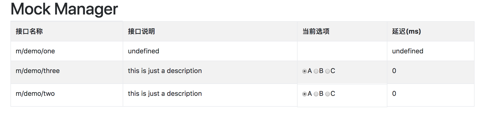

# Mock Server

## what is it ?
a simple mock server built on express, totally based on file system and dynamic reload

## how to use
```sh
git clone https://github.com/skidxjq/mock-server
cd mock-server && npm install
npm run mock
```
and then open [Mock Manager](http://localhost:8080/interface/interface-admin/public/index.html)

## examples

### demo1
if you want to create a API named '/m/demo/one', you should create a folder totally the same with API except for  replacing '/' with '-',
then you could create an ***index.js*** file in this folder, and make your mock data as default export.
```sh
cd data && mkdir m-demo-one
touch index.js
echo 'module.exports = ${your_data}' > index.js
```
file conent in data/m-demo-one/index.js
```js
module.exports = {
  "code": 0,
  "msg": "success",
  "data": {
    "name": "skidxjq",
    "age": 18
  }
}
```
### demo2
if you want to create a API named '/m/demo/two', serveral alternatives of mock data are prepared, you may switch one to another, just shown as image below.


if you want to mock your data in three ways
how to do it 
```sh
cd data && mkdir m-demo-two
touch A.js B.js C.js
echo 'module.exports = ${data_A}' > A.js
echo 'module.exports = ${data_B}' > B.js
echo 'module.exports = ${data_C}' > C.js
```
how to configure
```sh
cd data && mkdir m-demo-two
touch map.json
echo ${config_data} > map.json
```
the content of map.json should be like as below,
```keys``` should be in line with names of data files in folder ```interface```
```delay``` describe the delay ms time (default 0)
```json
{
  "desc": "this is just a description",
  "keys": {
    "A": "data A",
    "B": "data B",
    "C": "data C"
  },
  "delay": 0
}
```

change current mock data via http://localhost:8080/interface-admin/public/index.html

### demo3
make a response based on the request parameters, such as check ```req.body``` or validate your parameters submitted from a html form
how to do it .
see examples in data/m-demo-three.


## Advantages
- Do not need to restart your server, our core principle is url pattern matching, and make it like a express router
- custom your own response based on request  parameters
- dynamicly switch one data to another on dashboard

## Cautions
- There are no ways to nest your APIs, you should relate  one ***api folder***  to  the specified  ***api name*** .
- In this example, we defined the specified started with 'm-' matches those folders and apis, in your application, you could change or remove it on your own.